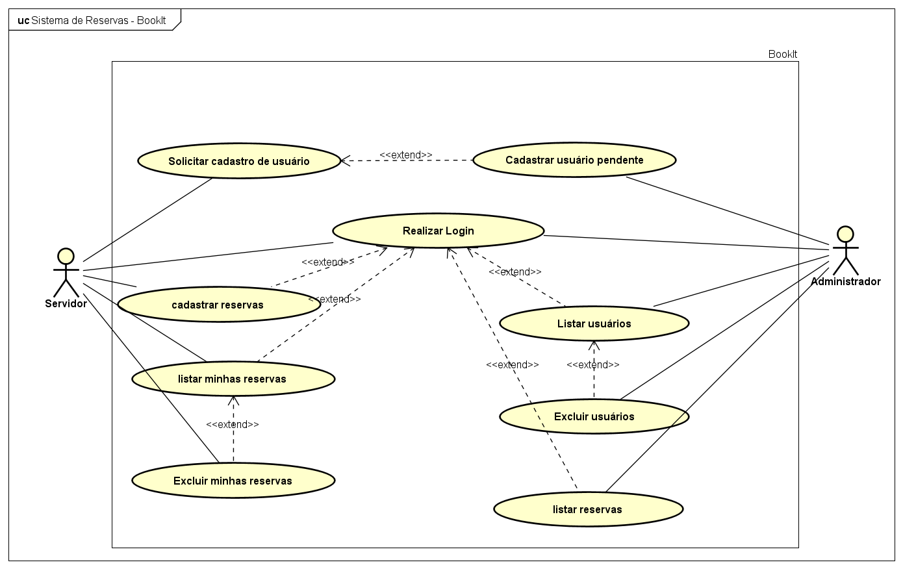
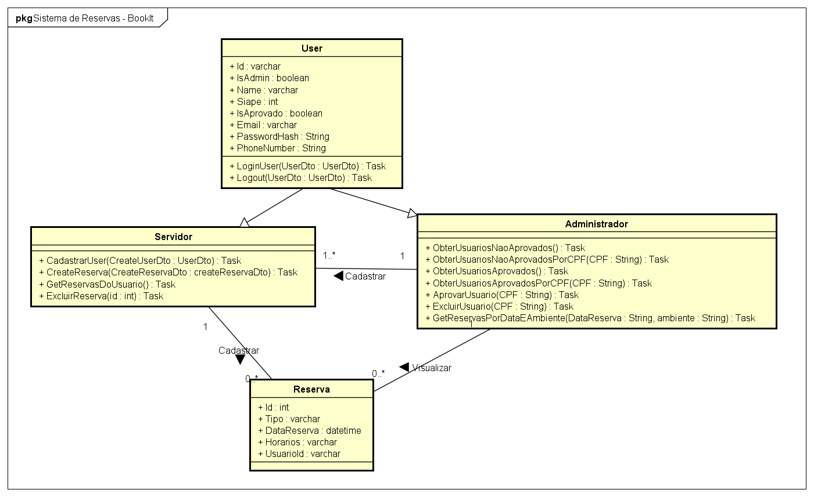

# Sistema de Reservas - BookIt

## Introdução

O Instituto de Ciências Exatas e Tecnologia (ICET) da Universidade Federal do Amazonas (UFAM) necessita de um sistema eficiente para o gerenciamento de reservas de ambientes e veículos institucionais. O projeto BookIt surge como uma solução web moderna, proporcionando maior controle e transparência no uso dos recursos disponíveis, otimizando os processos administrativos e acadêmicos da instituição.

O BookIt será desenvolvido com tecnologias robustas e amplamente utilizadas no mercado, garantindo segurança, escalabilidade e eficiência. O frontend será desenvolvido com React, enquanto o backend utilizará C#. O banco de dados será gerenciado pelo MySQL, e a autenticação será feita por meio de JWT (JSON Web Tokens). Além disso, o envio de e-mails será realizado via SMTP (Gmail), e a aplicação será containerizada utilizando Docker.

O sistema será estruturado com diferentes níveis de acesso, garantindo que cada usuário tenha permissões específicas de acordo com sua função na instituição. O administrador terá a responsabilidade de aprovar ou recusar solicitações de reserva realizadas por técnicos e docentes, bem como gerenciar cadastros de novos usuários. Além disso, poderá alterar o status dos veículos e salas, permitindo melhor controle sobre sua disponibilidade.

Os técnicos e docentes poderão realizar reservas de salas de reunião, auditórios e veículos, informando data e horário desejados. Eles também poderão se cadastrar no sistema, embora o acesso só seja concedido após a aprovação do administrador. Além disso, terão a opção de cancelar reservas previamente feitas, proporcionando maior flexibilidade na utilização dos recursos institucionais.

O fluxo de autenticação e acesso ao sistema BookIt será seguro e eficiente. O administrador já virá cadastrado diretamente no sistema, enquanto técnicos e docentes deverão fornecer informações como SIAPE, CPF, nome, e-mail, celular e senha no momento do cadastro. No entanto, o acesso só será liberado após a aprovação do administrador, garantindo um controle rigoroso sobre os usuários que utilizarão o sistema.

O desenvolvimento do BookIt trará mais organização e eficiência ao processo de gestão de reservas do ICET/UFAM. A utilização de tecnologias modernas permitirá um sistema seguro, intuitivo e acessível, garantindo que as reservas de ambientes e veículos sejam realizadas de maneira simplificada e eficaz. Com isso, a instituição poderá otimizar seus recursos e melhorar a experiência de seus usuários, promovendo um ambiente acadêmico e administrativo mais dinâmico.

## Prototipação

A prototipação desempenha um papel fundamental no desenvolvimento do sistema BookIt, uma vez que permite visualizar e validar a interface e a experiência do usuário antes da implementação final. Utilizando o Figma como ferramenta de prototipação, foi possível criar representações interativas do sistema, facilitando a identificação de melhorias e garantindo que o design atenda às necessidades dos usuários. Esse processo possibilitou a realização de ajustes na interface de forma ágil e colaborativa, permitindo que a equipe de desenvolvimento e os stakeholders tivessem uma visão clara de como o sistema funcionaria na prática. Além disso, a prototipação reduziu significativamente o risco de retrabalho, pois erros e inconsistências puderam ser detectados e corrigidos na fase inicial do projeto. Dessa forma, a utilização do Figma como ferramenta de prototipação foi essencial para garantir um sistema intuitivo, acessível e eficiente, contribuindo para a qualidade final do BookIt e para a satisfação dos seus usuários.

Clique <a href="https://www.figma.com/proto/FQ4Kz2ZVfkdwBJBknppLl4/Sistema-de-reservas?node-id=1-2&t=KB24on9iLsvVrzo1-1" target="_blank">AQUI</a> para visualizar, na íntegra, o protótipo do sistema de reservas BookIt.

## Diagrama de caso de uso

O diagrama de caso de uso elaborado para o sistema BookIt desempenha um papel essencial na definição e organização dos requisitos funcionais do projeto. Esse diagrama possibilita uma representação visual clara das interações entre os usuários e o sistema, ajudando a equipe de desenvolvimento a compreender melhor os processos e garantir que todas as funcionalidades essenciais sejam contempladas. Além disso, a criação do diagrama de caso de uso facilita a comunicação entre os stakeholders, permitindo um alinhamento preciso das expectativas em relação ao funcionamento da aplicação. Com essa abordagem, é possível identificar potenciais melhorias e prever desafios antes da implementação, reduzindo falhas e aumentando a eficiência do desenvolvimento. Assim, o diagrama de caso de uso contribui diretamente para a construção de um sistema mais bem estruturado, atendendo às necessidades dos usuários de forma eficaz e garantindo maior confiabilidade no processo de reserva de ambientes e veículos dentro do ICET/UFAM.

    Abaixo podemos visualizar na íntegra o diagrama de caso de uso do Sistema BookIt.

    

## Diagrama de Classes

O diagrama de classes é uma ferramenta essencial no desenvolvimento do sistema BookIt, pois possibilita a modelagem estruturada dos componentes do software, definindo as relações entre os objetos e suas responsabilidades dentro do sistema. Esse diagrama permite uma visão clara da organização interna do código, ajudando a equipe de desenvolvimento a criar um sistema coeso, modular e de fácil manutenção. Além disso, o diagrama de classes facilita a implementação de boas práticas de programação, promovendo a reutilização de código e a separação adequada das responsabilidades entre as classes. Por meio desse modelo, foi possível estabelecer a estrutura do BookIt de forma lógica e eficiente, garantindo que os relacionamentos entre usuários, reservas, ambientes e veículos fossem bem definidos e consistentes. Dessa maneira, a utilização do diagrama de classes contribui significativamente para a qualidade e robustez do sistema, reduzindo erros durante a implementação e facilitando futuras expansões e melhorias.

    Abaixo podemos visualizar na íntegra o diagrama de classes do Sistema BookIt.

    

